# Вэб-приложение для начальников участка по эксплуатации лифтов, эскалаторов, для электромехаников по лифтам и эскалаторам. Под названием "НООПЕПТ для лифтов"
 * * *
Это вэб-приложение представляет собой программу для управления необходимой информацией по лифтам, эскалаторам, сотрудникам и заказчикам. Ранее приложение работало на VPS сервере на домене https://mer1d1an.ru/ сейчас домен оставлен для тестов.

### Запуск проекта
***

1. Клонировать репозиторий:
```bash

git clone https://github.com/meR1D1AN/meh_itr.git
cd meh_itr
```
2. Скопируйте файл .env.sample в .env и внесите Ваши данные:
```bash

cp .env.sample .env
```
3. Установка зависимостей и активация виртуального окружения:
```bash

poetry install
poetry self add poetry-plugin-shell
poetry shell
```
4. Запуск сервера с помощью docker-compose:
```bash

docker-compose up -d --build
```

Что представляет собой это вэб приложение:
1. Простейшая аутентификация с помощью JWT.
2. CRUD операции с лифтами, эскалаторами, сотрудниками и заказчиками.
3. Поиск по сотрудникам и заказчикам.
4. Редактирование данных лифтов, эскалаторов, сотрудников и заказчиков.

Главная страница после авторизации:
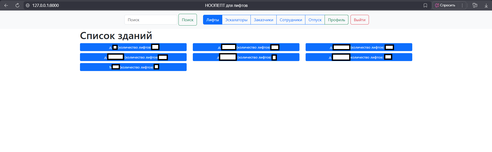
Страница зданий, где есть лифты:
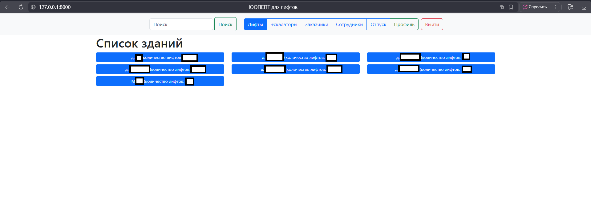
Страница со всеми лифтами в одном здании:
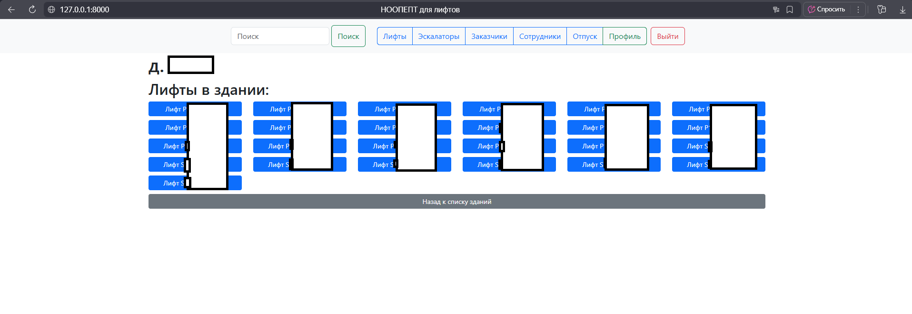
Страница с  детальной информацией о лифте, тут можно вписать больше инфы о лифте, дата производства, ГП, и т.д., можно добавить проблему, вписав её вручную, после того как проблему решит механик, можно нажат кнопку Решено. Подобное и с Ремонтами, можно записать, что стоит заменить или отремонтировать, и так же отметить, что ремонт решён. Проведение ТО происходит автометически, при нажатии на кнопку добавить, записывается дата и время, когда ТО было проведено, дважды за один день дату ТО нельзя поставить *ТО - техническое обслуживание
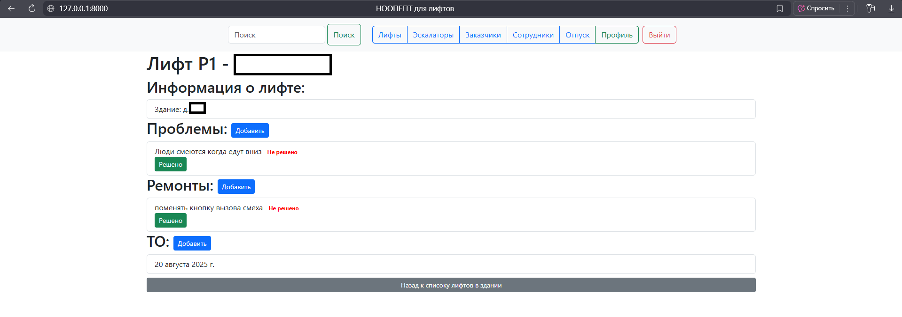
Страница со всеми эскалаторами в одном здании, дополнительно выводится кол-во проблем с эскалаторами, какая проблема и дата когда эта проблема появилась:
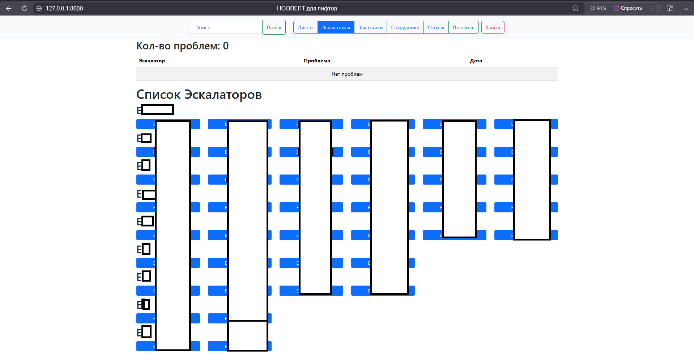
Страница с детальной информацией об эскалаторе, функционал тот же что и у лифтов, только при сохранении добавляется еще дата и время, когда была добавлена проблема или ремонт, ТО принцип точно такой же как и у лифтов:
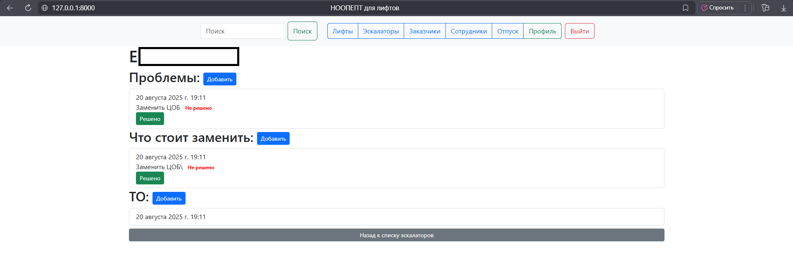
Страница Всех заказчиков, видны только созданные тобой
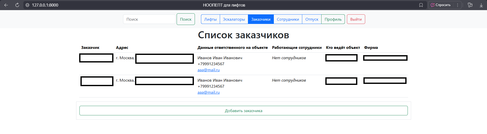
Страница детальной информации о заказчике, здесь можно внести все данные, которые необходимы:
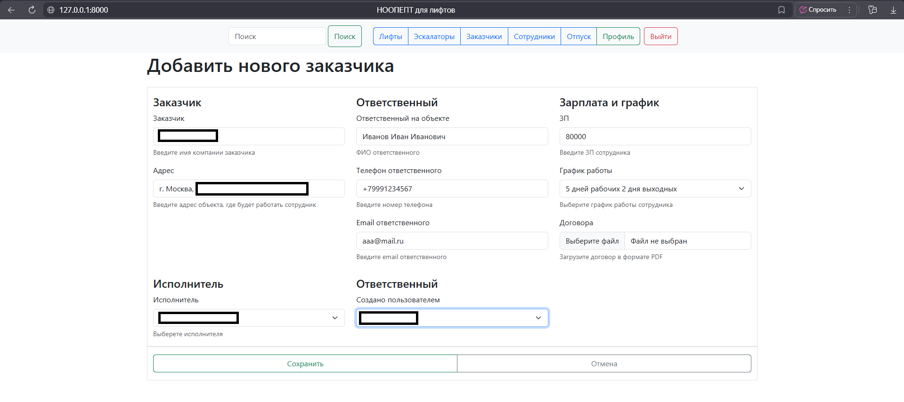
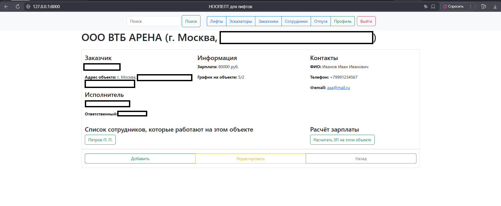
Страница с графиком сотрудников, которые закреплены за заказчиком, с автоматическим подсчётом зарплаты, при разных графиках 3/1, 2/2, 5/2:
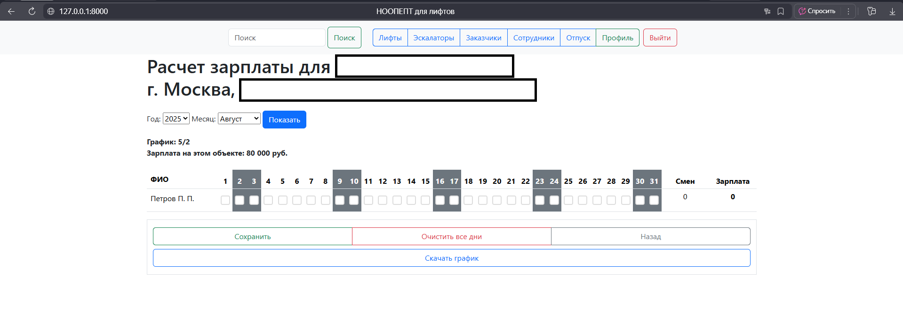
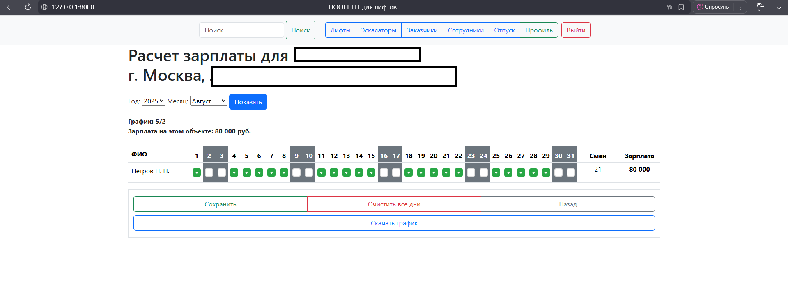
Сам график в формате excel, чтобы можно было отправить заказчику на согласование, и после согласования распечатать и подписать и отвезти в двух экземплярах:
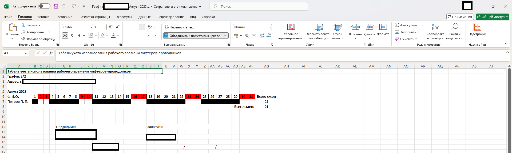
Страница со всеми сотрудниками, можно видеть только тех сотрудников, которых ты добавлял
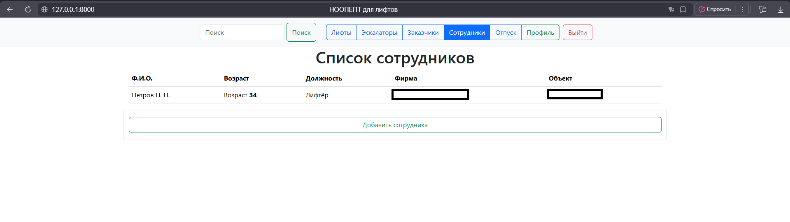
Страница создания сотрудника и закрепление его за заказчиком
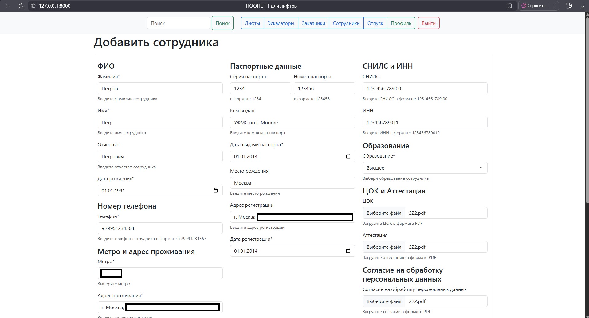
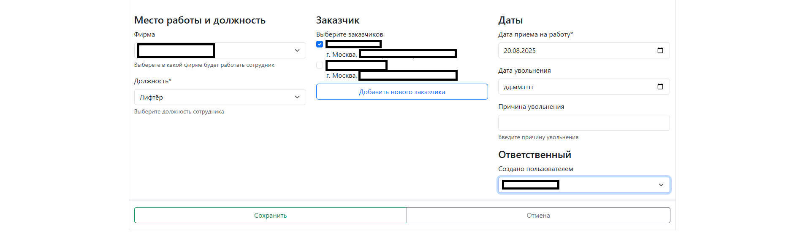
Страница со всеми отпусками всех сотрудников, которых ты добавил, а так же свой отпуск
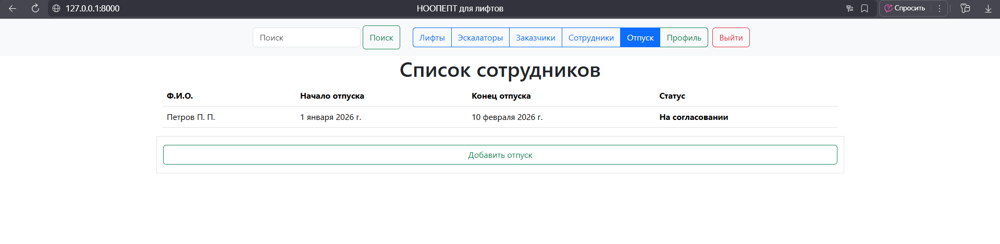
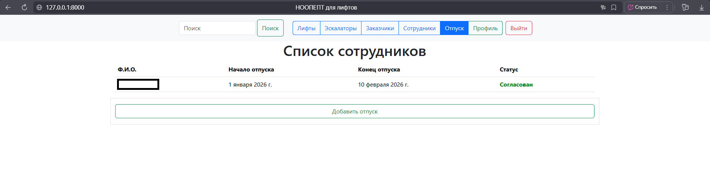
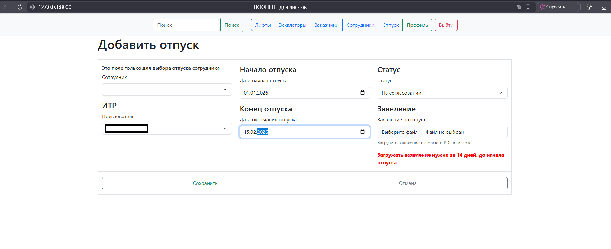
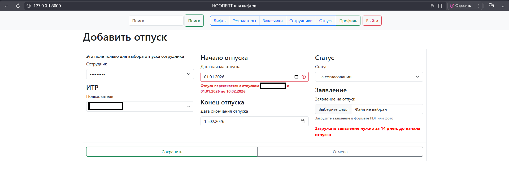
Страница профиля, где есть инфомация о себе, кол-во сотрудников созданых и закреплённых за тобой, кол-во заказчиков, и отпуск
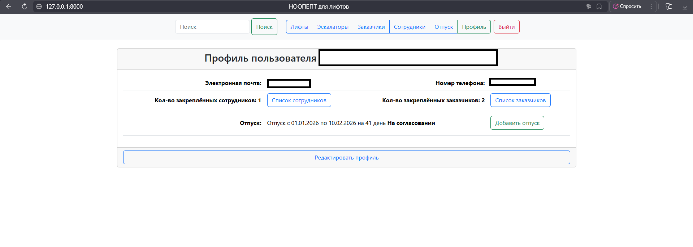


